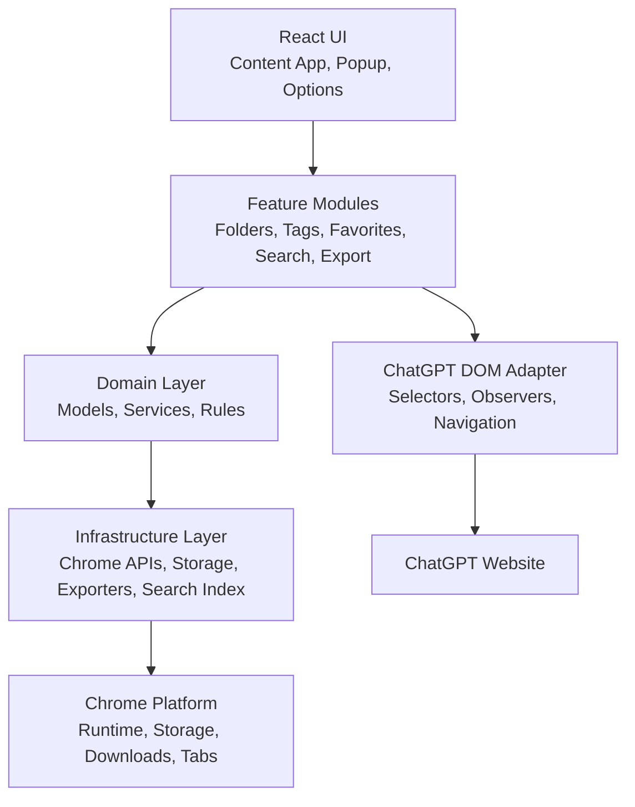
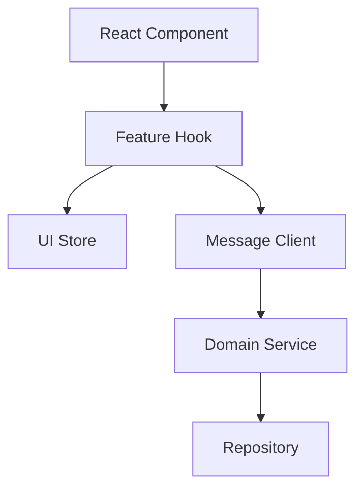
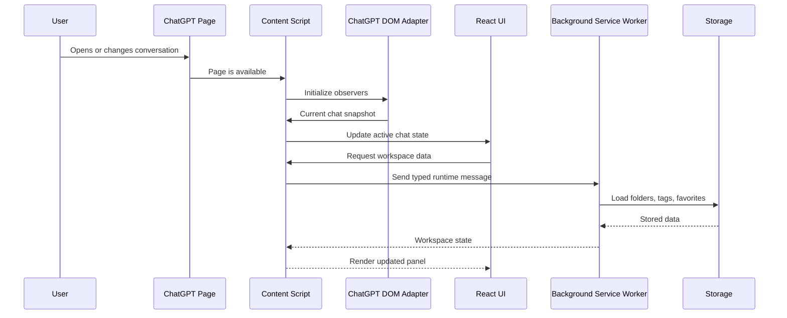
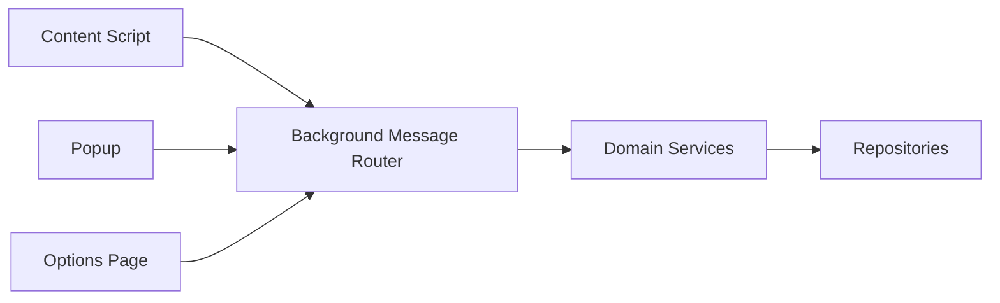
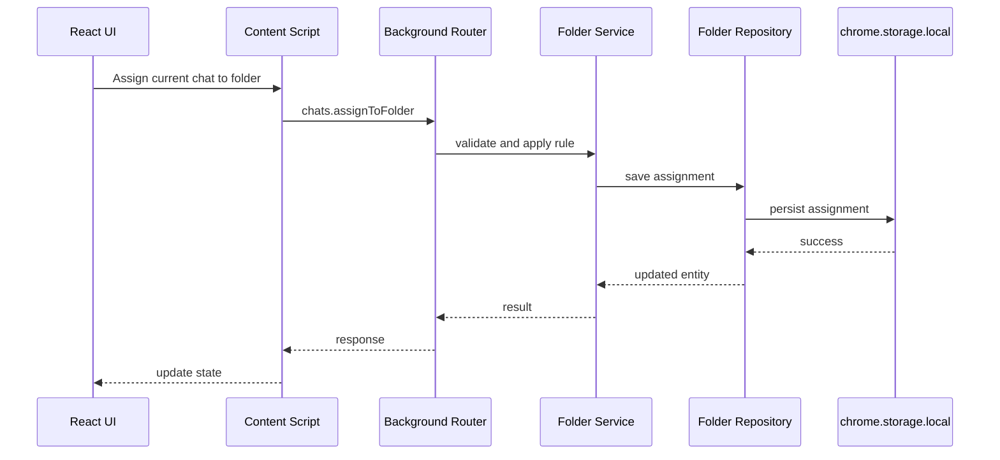
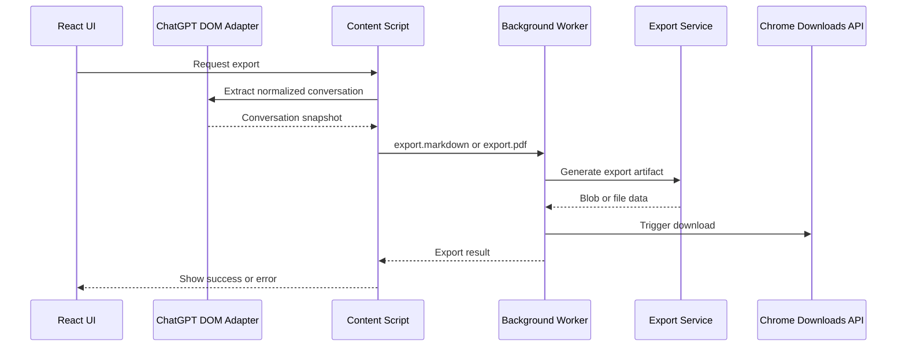
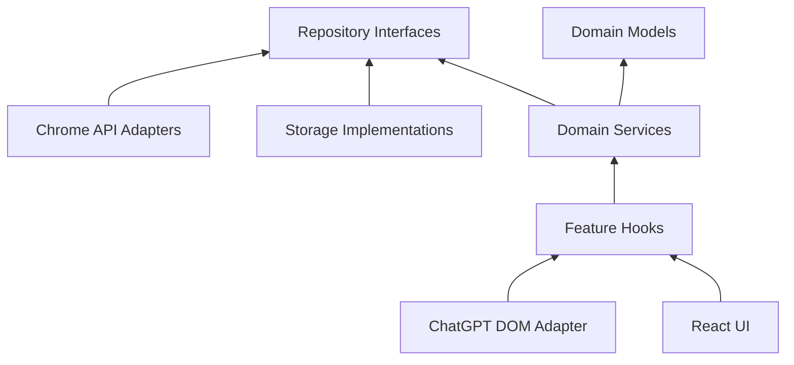

# ChatGPT Workspace Architecture

## Overview

ChatGPT Workspace is a Chrome Extension built with Manifest V3, TypeScript, React, Vite, Tailwind CSS, Chrome Storage APIs, content scripts, and a background service worker.

The architecture follows clean architecture principles:

- Product and domain logic are independent from React.
- Chrome APIs are wrapped behind infrastructure adapters.
- ChatGPT DOM access is isolated in a dedicated adapter.
- Storage access goes through repositories and migrations.
- Runtime messages use typed contracts and runtime validation.
- Features are organized by business capability.

## Architectural Layers



## Extension Lifecycle

1. The user opens ChatGPT.
2. Chrome loads the content script on matching ChatGPT pages.
3. The content script initializes the ChatGPT DOM adapter.
4. The adapter detects the current conversation, title, URL, and available message content.
5. The React UI mounts into an isolated extension container.
6. The UI requests stored workspace data through the content script/background message channel.
7. The background service worker routes messages to domain services and repositories.
8. Repositories persist or retrieve data from local Chrome storage and IndexedDB.
9. The UI updates based on returned state.
10. Observers continue tracking single-page-app navigation and conversation changes.

## Manifest V3 Architecture

Manifest V3 introduces a service-worker-based extension model. The service worker is event driven and may sleep when idle. The architecture must assume the background process is not permanently alive.

### Manifest Responsibilities

- Declare content script matches for ChatGPT pages.
- Register the background service worker.
- Define permissions with the smallest practical scope.
- Define extension pages such as popup and options if used.
- Define icons, name, version, and content security policy.

### Service Worker Constraints

- It can be terminated by Chrome when idle.
- Long-running in-memory state is unreliable.
- All durable state must be persisted.
- Message handlers must be fast and resumable.
- Expensive work should be chunked when possible.

## React Architecture

React is used for extension UI surfaces:

- Injected ChatGPT workspace panel.
- Popup UI if needed for quick actions.
- Options page for settings, data management, and future account/sync controls.

React components should be mostly presentational. Business logic belongs in feature services, domain services, hooks, and repositories.



## Content Script Flow

The content script is the bridge between the ChatGPT page and the extension.

Responsibilities:

- Mount the injected React application.
- Detect ChatGPT SPA navigation.
- Read current conversation metadata.
- Extract conversation messages for indexing or export.
- Observe relevant DOM changes.
- Send typed messages to the background service worker.
- Avoid direct persistence except through approved APIs.



## Background Service Worker Responsibilities

The background service worker is the coordination layer for extension-wide operations.

Responsibilities:

- Route messages from content scripts, popup, and options pages.
- Validate incoming messages.
- Call domain services.
- Coordinate repository reads and writes.
- Manage storage migrations.
- Handle export generation where appropriate.
- Trigger downloads using Chrome APIs.
- Provide a future boundary for sync, authentication, analytics, and billing.

It should not contain UI logic or ChatGPT DOM logic.

## Storage Layer

The MVP uses a local-first storage model.

### Chrome Storage Local

Use `chrome.storage.local` for structured metadata:

- Folders.
- Tags.
- Chat metadata.
- Folder assignments.
- Tag assignments.
- Favorite state.
- User settings.
- Schema version.

### IndexedDB

Use IndexedDB for larger data:

- Conversation snapshots.
- Search documents.
- Search index data.
- Export preparation cache if needed.

### Storage Principles

- All persisted data must have a schema version.
- Stored data must be validated when read.
- Migrations must be explicit and testable.
- Repositories must hide storage implementation details from features.
- The app must tolerate partial or missing data.

## Communication Between Modules

All cross-context communication should use typed message contracts.



Message examples:

- `folders.create`
- `folders.rename`
- `folders.delete`
- `chats.assignToFolder`
- `favorites.toggle`
- `tags.create`
- `tags.assignToChat`
- `search.query`
- `export.markdown`
- `export.pdf`
- `storage.migrate`

Each message should define:

- Type.
- Payload schema.
- Response schema.
- Error shape.
- Permission assumptions.

## Folder Structure

```text
src/
├─ background/
│  ├─ service-worker.ts
│  ├─ message-router.ts
│  └─ lifecycle/
├─ content/
│  ├─ main.tsx
│  ├─ chatgpt-dom-adapter/
│  ├─ injected-ui/
│  └─ observers/
├─ popup/
├─ options/
├─ features/
│  ├─ folders/
│  ├─ chats/
│  ├─ favorites/
│  ├─ tags/
│  ├─ search/
│  └─ export/
├─ domain/
│  ├─ models/
│  ├─ repositories/
│  └─ services/
├─ infrastructure/
│  ├─ chrome/
│  ├─ storage/
│  ├─ export/
│  └─ search-index/
├─ shared/
│  ├─ constants/
│  ├─ errors/
│  ├─ schemas/
│  ├─ types/
│  └─ utils/
└─ styles/
```

## Data Flow

### Assigning A Chat To A Folder



### Exporting A Conversation



## Dependency Graph

Dependencies should point inward toward stable business rules and outward only through interfaces.



Forbidden dependency directions:

- Domain services must not import React.
- Domain services must not import Chrome APIs directly.
- Repositories must not import React components.
- Feature UI must not query ChatGPT DOM directly.
- Shared utilities must not import feature modules.

## Future Architecture Boundaries

Future capabilities should attach through interfaces:

- `AuthProvider`
- `SyncProvider`
- `BillingProvider`
- `AnalyticsProvider`
- `AiSearchProvider`
- `SummaryProvider`
- `PromptLibraryRepository`

These interfaces should remain unused in the MVP unless needed for clear forward compatibility.
