# Architecture

## Overview

ChatGPT Workspace is a Manifest V3 Chrome Extension with a content-script-driven React UI. The content UI is mounted inside a Shadow DOM to isolate extension styles and behavior from ChatGPT.

The application follows a layered dependency flow:

```text
UI -> Hooks -> Services -> Repositories -> Storage Adapter -> Chrome Storage
```

UI components do not access Chrome APIs directly. ChatGPT DOM access is isolated to the conversation detection engine.

## Runtime Architecture

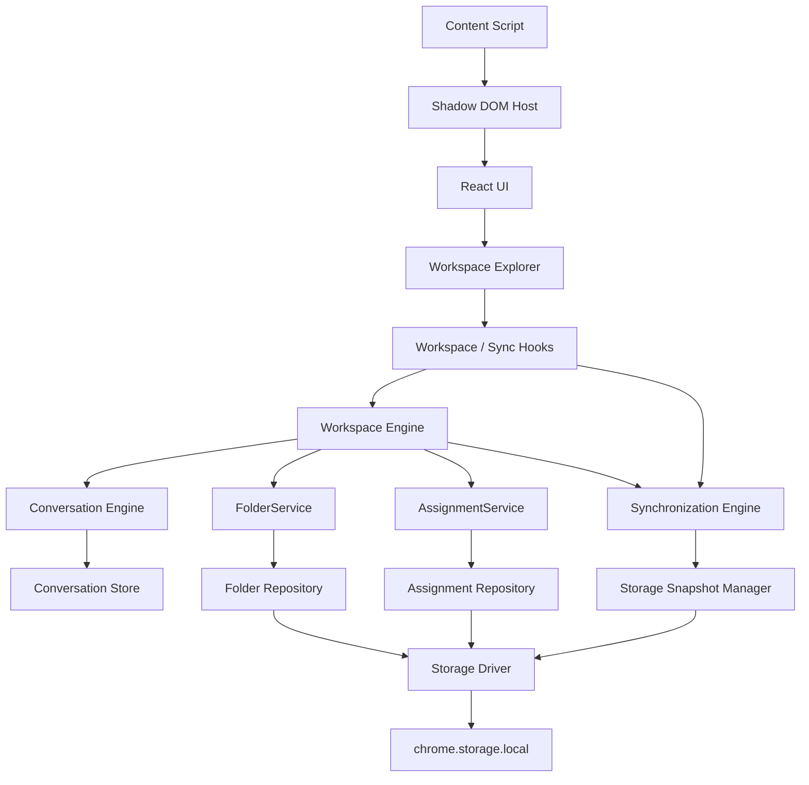

## Extension Lifecycle

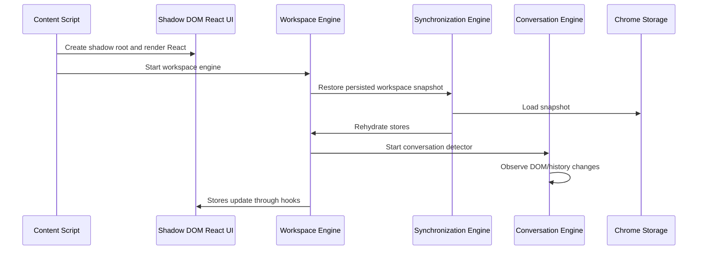

## Manifest V3 Responsibilities

- `public/manifest.json` defines content scripts, popup, options, background worker, permissions, host matches, and extension CSP.
- `src/background/service-worker.ts` is intentionally minimal until background coordination is needed.
- `src/content/main.tsx` creates the Shadow DOM host, starts the Workspace Engine, and renders the React root.

## Core Engines

### Workspace Engine

Owns application lifecycle, command dispatch, query access, subsystem registration, and cross-feature coordination.

### Conversation Engine

Owns all ChatGPT DOM observation. It centralizes selectors, maps DOM candidates to normalized conversation models, observes navigation/history changes, and prevents UI components from querying the page directly.

### Folder Domain

Owns folder model, validation, repository, service, state, hooks, and folder UI.

### Assignment Domain

Owns normalized conversation-to-folder assignments and emits typed assignment events.

### Synchronization Engine

Owns persistence, snapshot creation, recovery, conflict resolution, sync queues, storage change handling, and UI preference persistence.

### Workspace Explorer

The primary user-facing surface for browsing and organizing conversations. It derives folder tree nodes, conversation lists, active indicators, filters, and workspace counters from Workspace Engine state. It dispatches changes through Workspace Engine commands and uses the Synchronization Engine only for UI preferences such as expanded folders.

### Universal Search Engine

The provider-based search platform for workspace data. It indexes folders, conversations, and assignments today, and is designed for future tags, favorites, notes, summaries, and semantic embeddings.

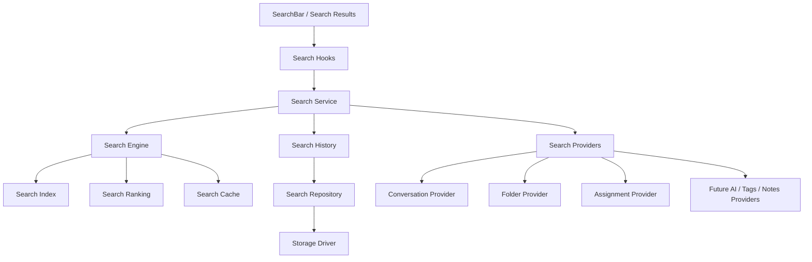

## Search Index Lifecycle

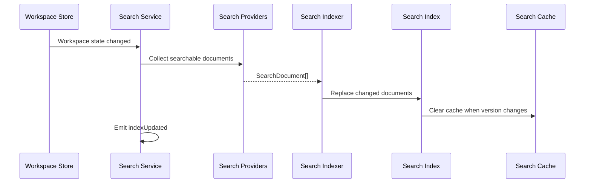

## Search Provider Registration

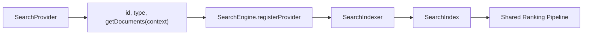

## Search Data Flow

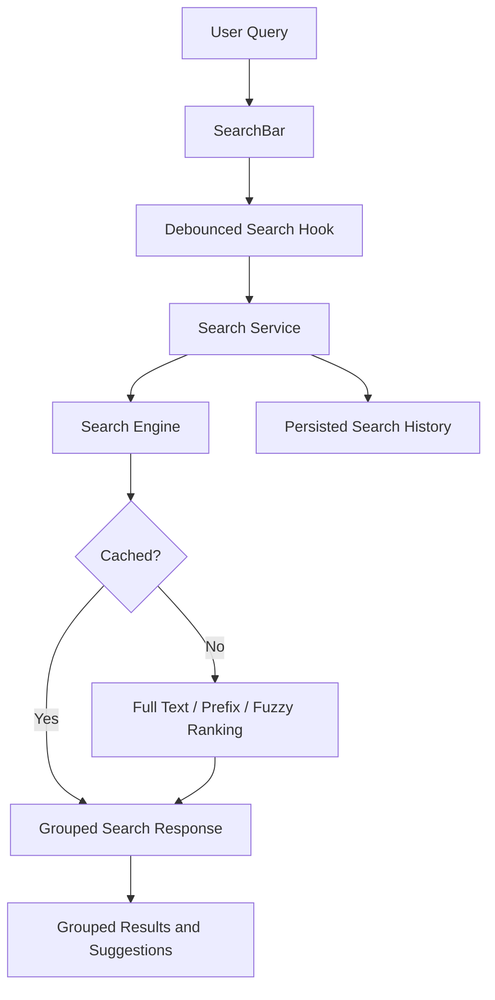

### Quick Action Framework

The central interaction layer for conversations and bulk operations. Actions are supplied by providers and executed through a shared registry/executor pipeline. UI surfaces such as context menus, toolbars, folder pickers, and future command palettes consume the same action framework.

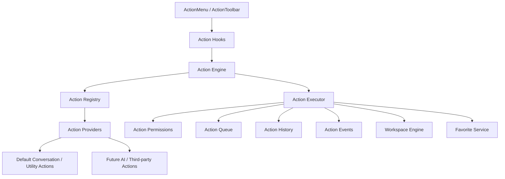

## Action Lifecycle

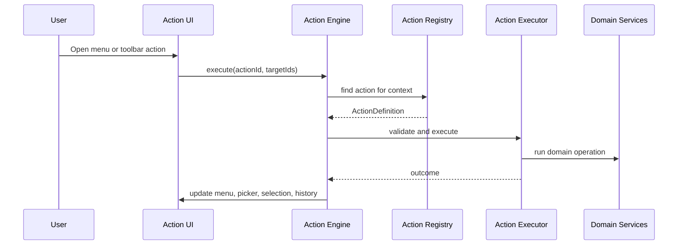

## Registry Flow

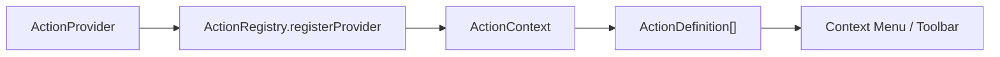

## Execution Pipeline

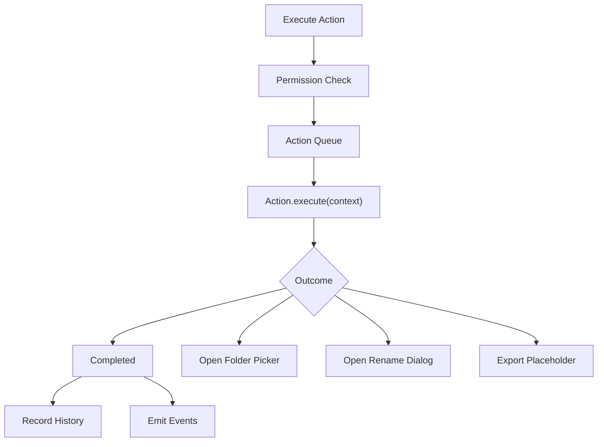

## Selection Flow

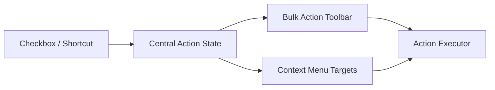

## Context Menu Architecture

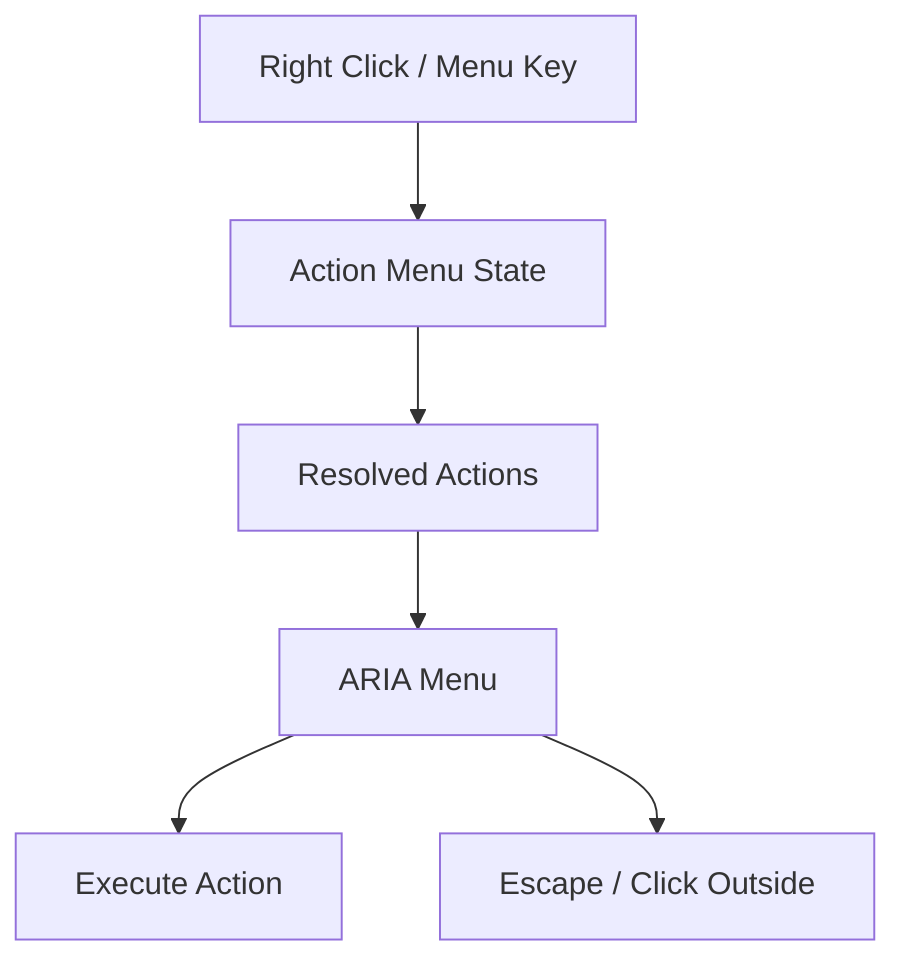

## Synchronization Flow

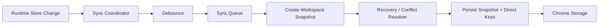

## AI Platform

The AI Intelligence Layer is an orchestration platform only. It does not call external AI APIs by default. Future providers implement `AIProvider` and register with the `AIRegistry`; tasks then flow through the same queue, cache, event, history, and settings infrastructure.

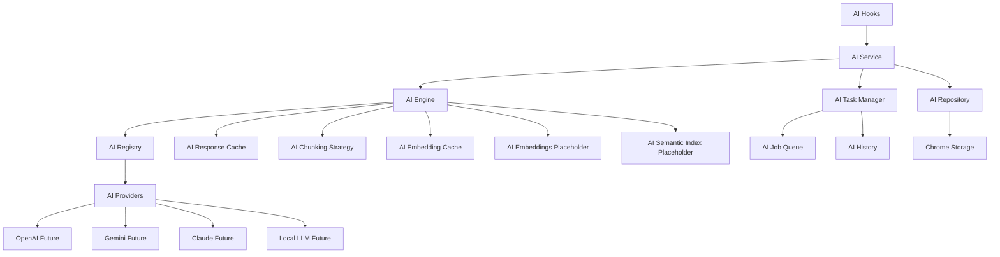

## Provider Flow

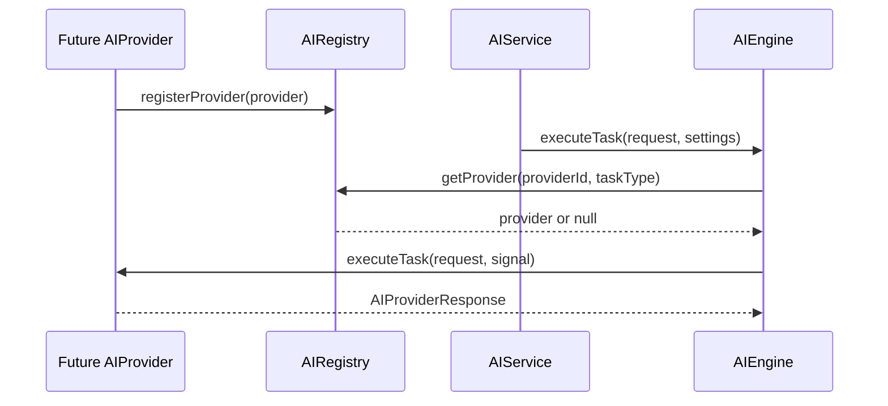

## Task Pipeline

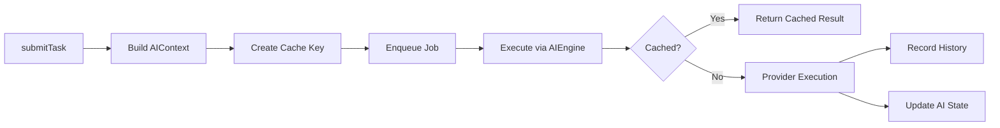

## Semantic Pipeline

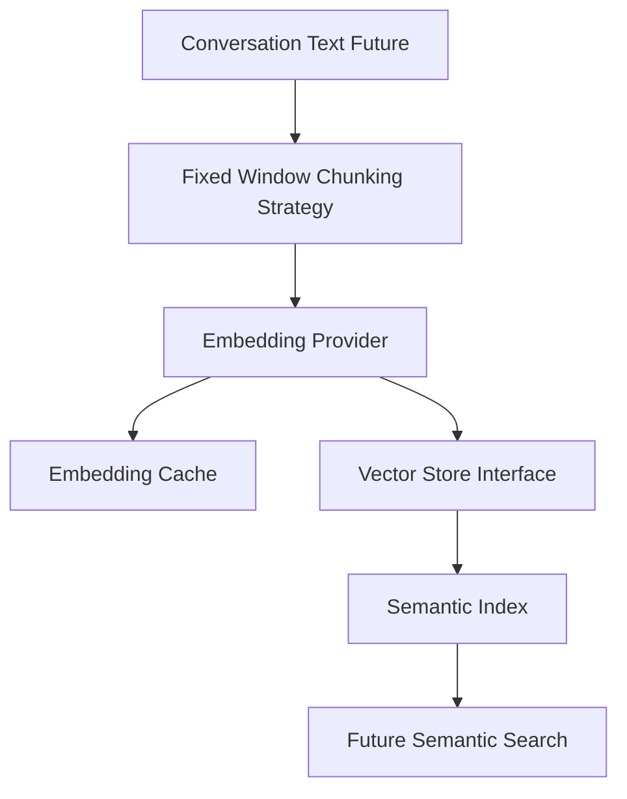

## AI Job Queue

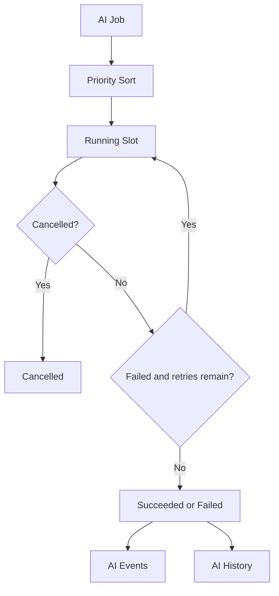

## Provider-Agnostic Platform

The Provider Platform is the neutral runtime boundary for all current and future AI services. Provider-specific DOM handling, SDK calls, authentication details, rate-limit behavior, streaming quirks, and attachment rules must live inside provider adapters. The rest of the workspace talks to provider interfaces only.

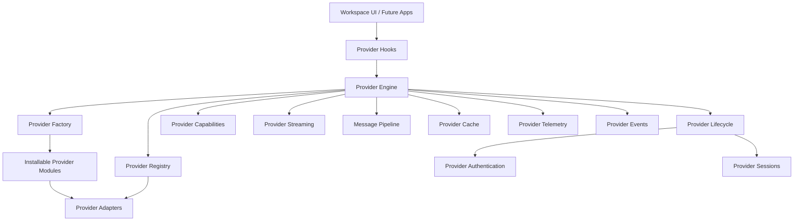

## Provider Lifecycle

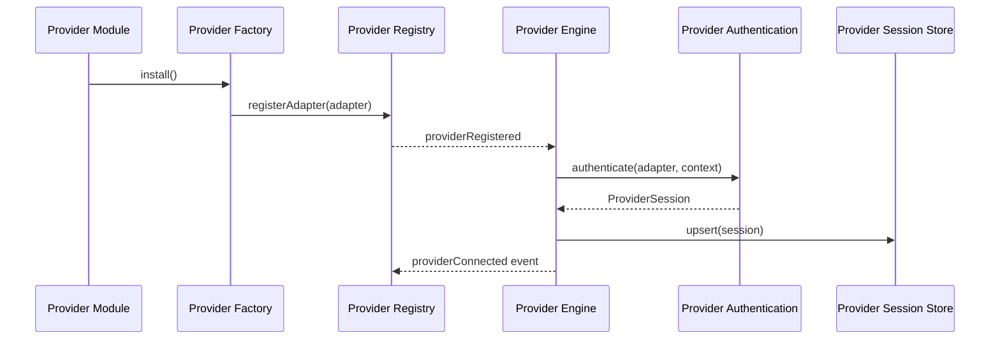

## Conversation Flow

```mermaid
flowchart LR
  Workspace["Workspace"] --> Engine["Provider Engine"]
  Engine --> Adapter["Provider Adapter"]
  Adapter --> Conversation["ProviderConversation"]
  Conversation --> History["ProviderHistory"]
  History --> Threads["ProviderThread[]"]
  Threads --> Messages["ProviderMessage[]"]
  Messages --> Attachments["ProviderAttachment[]"]
  Messages --> Pipeline["Incoming Message Pipeline"]
```

## Streaming Flow

```mermaid
flowchart TD
  Request["Streaming Request"] --> Stream["Provider Streaming"]
  Stream --> Start["Start"]
  Start --> Chunks["Chunk Events"]
  Chunks --> Pause{"Pause?"}
  Pause -- Yes --> Paused["Paused"]
  Paused --> Resume["Resume"]
  Resume --> Chunks
  Pause -- No --> Complete{"Complete?"}
  Complete -- Yes --> Finished["Finished Event"]
  Complete -- No --> Cancel{"Cancel?"}
  Cancel -- Yes --> Cancelled["Cancelled"]
  Cancel -- No --> Error["Error Event"]
```

## Plugin Architecture

```mermaid
flowchart TD
  Plugin["Platform Plugin"] --> Registry["Plugin Registry"]
  Registry --> Provider["AI Provider Plugin"]
  Registry --> Exporter["Exporter Plugin"]
  Registry --> Search["Search Provider Plugin"]
  Registry --> Theme["Theme Plugin"]
  Registry --> Automation["Automation Plugin"]
  Registry --> Actions["Custom Action Plugin"]
```

## Capability Detection

```mermaid
flowchart LR
  Adapter["Provider Adapter"] --> Capabilities["ProviderCapabilities"]
  Capabilities --> Streaming["Streaming"]
  Capabilities --> Vision["Vision"]
  Capabilities --> Upload["PDF / File Upload"]
  Capabilities --> Voice["Voice"]
  Capabilities --> Tools["Tool Calling / MCP"]
  Capabilities --> UI["Adaptive UI"]
```

## Data Ownership

- Folders: `src/features/folders`.
- Conversations: `src/features/conversations`.
- Assignments: `src/features/assignments`.
- Favorites: `src/features/favorites`.
- Quick actions: `src/features/actions`.
- Search: `src/features/search`.
- AI Intelligence: `src/features/ai`.
- Provider platform: `src/platform/providers`.
- Plugin platform: `src/platform/plugins`.
- Workspace runtime: `src/app/workspace`.
- Persistence and UI preferences: `src/app/synchronization`.

## Dependency Rules

- UI may depend on hooks and shared UI components.
- Workspace Explorer must derive state from Workspace Engine state rather than creating a parallel store.
- Search providers must expose normalized documents through the Search Engine instead of coupling search to individual UI features.
- Future quick actions must register through an ActionProvider instead of being hardcoded into the Explorer.
- Future AI providers must implement `AIProvider`; provider-specific SDK logic must not leak into UI, search, actions, or workspace engines.
- Future AI services must also implement provider adapters before integrating with shared workspace surfaces.
- Provider-specific authentication, streaming, attachments, and rate-limit behavior must remain inside adapter modules.
- Hooks may depend on services and stores.
- Services may depend on repositories, events, validation, and stores.
- Repositories may depend on storage interfaces.
- Storage adapters may depend on Chrome APIs.
- Conversation detection may access ChatGPT DOM.
- No UI module may query ChatGPT DOM or Chrome Storage directly.
