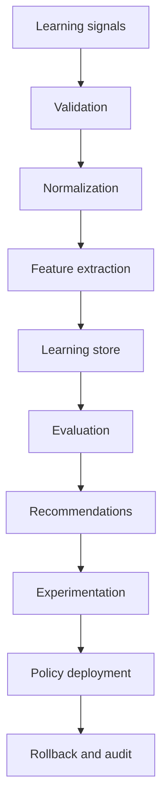

# RFC-026: Autonomous Learning and Continuous Improvement Engine

## Mission

The Autonomous Learning Engine is the adaptive intelligence layer of the platform. It continuously learns from interactions, outcomes, and feedback to improve platform-layer decisions without retraining foundation models or silently rewriting product behavior.

## Non-Negotiable Rules

- Learning is opt-in by user or organization scope.
- Learned behavior is explainable, auditable, versioned, and reversible.
- Recommendations must cite evidence.
- Automatic deployment requires confidence, safety, and experiment gates.
- Administrator-reviewed domains, such as enterprise policy changes, never auto-activate.
- Feedback poisoning is mitigated through trust-weighting, validation, anomaly flags, and source isolation.
- Users can inspect, edit, export, and delete learned preferences.

## Architecture

## Core Components

- `LearningSignalCollector`: accepts raw feedback, workflow outcomes, performance observations, retrieval quality, and corrections.
- `LearningValidator`: enforces opt-in, retention, trust thresholds, source integrity, and poisoning checks.
- `FeatureExtractor`: converts normalized signals into reusable features.
- `LearningStore`: stores immutable signals, features, profiles, recommendations, experiments, deployments, and audit records.
- `PersonalizationEngine`: learns transparent preferences for writing style, coding conventions, model choices, automation frequency, UI behavior, and approval thresholds.
- `WorkflowOptimizer`: detects repeated workflows, bottlenecks, unused steps, failure paths, and automation opportunities.
- `PromptOptimizer`: compares prompt versions, scores quality, supports A/B testing, safe promotion, and rollback.
- `ModelRoutingLearner`: recommends model routing changes using success, latency, cost, satisfaction, fallback history, and enterprise constraints.
- `ToolSelectionLearner`: scores tools by task type, latency, failure probability, acceptance, and permission constraints.
- `KnowledgeQualityEngine`: recommends re-indexing, cleanup, synchronization, and gap reporting.
- `MemoryEvolutionEngine`: recommends consolidation, summarization, archival, or expiration without silently deleting important memories.
- `ExperimentationPlatform`: owns feature flags, A/B tests, shadow evaluation, canary rollout, gradual rollout, and rollback.
- `PolicyOptimizer`: recommends security, cost, approval, and enterprise policy updates requiring administrator review.
- `ExplainabilityEngine`: answers what changed, why, evidence, confidence, learned time, and rollback path.
- `LearningPrivacyManager`: controls opt-in, scope isolation, retention, export, deletion, and data minimization.

## Deployment Model

The engine deploys learned behavior as policy versions. A deployment is a reversible record containing:

- target domain
- recommended change
- evidence
- confidence
- rollout strategy
- safety status
- rollback target
- approval requirement

## Observability

Every collection, validation, recommendation, experiment outcome, promotion, regression, and rollback is recorded in the learning audit log. The runtime is intentionally deterministic so failures are reproducible in tests.
