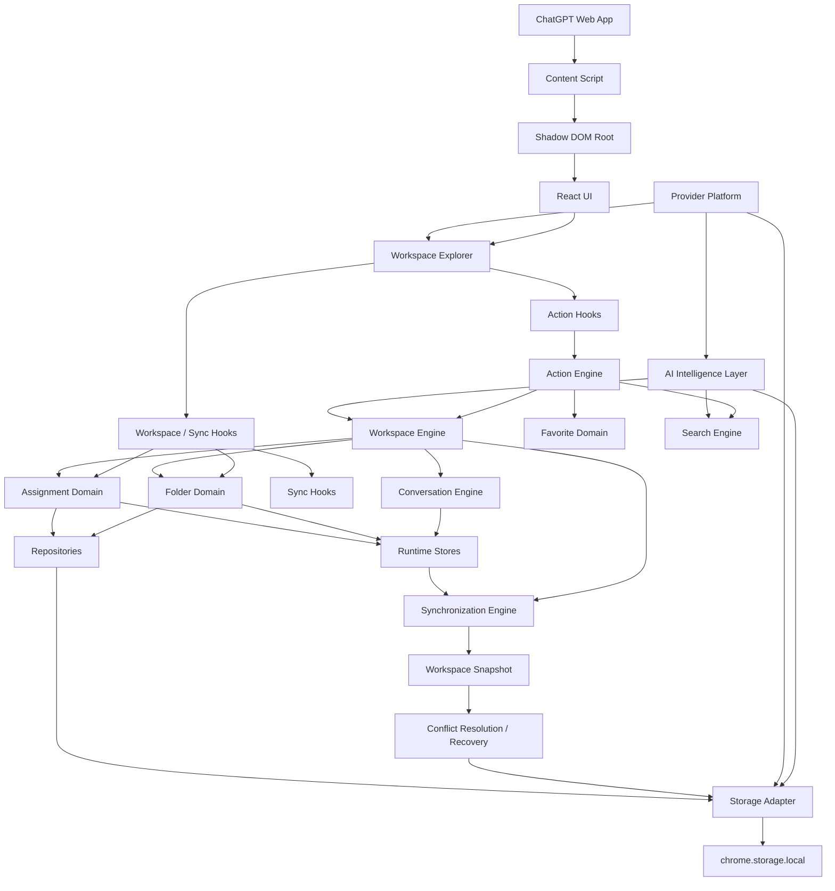
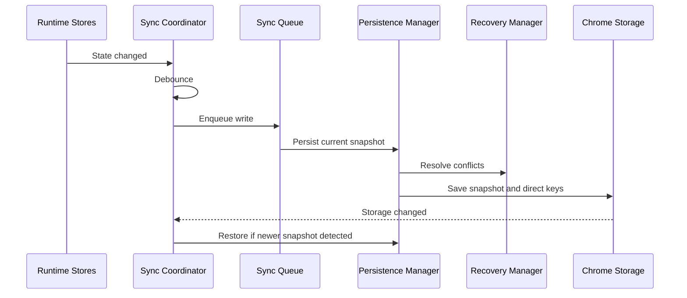

# Engineering Excellence Report

Date: 2026-07-07

## Executive Summary

The project is in good shape for a local-first beta foundation. The sprint focused on release readiness rather than new user-facing features. The most important improvements were reducing UI complexity, improving timer cleanup, adding reduced-motion support, making the extension CSP explicit, refreshing stale documentation, and keeping the synchronization-centered architecture clear.

The full verification pipeline passes.

Update: the Workspace Explorer is now implemented as the primary product surface. It adds folder tree navigation, filtered conversation lists, active conversation visibility, assignment visibility, workspace counters, and state handling while preserving the existing engine boundaries.

Update: the Universal Search Engine is now implemented as a provider-based indexed platform. It supports instant, full-text, prefix, partial, exact, fuzzy, multi-word, case-insensitive, whitespace-normalized, Unicode-safe search with grouped results, persistent history, suggestions, ranking, cache, and future semantic provider compatibility.

Update: the Quick Action Framework is now implemented as the central interaction layer for conversation operations. It adds provider-registered actions, context menus, bulk selection, keyboard shortcuts, folder picker moves, copy/open actions, favorites, rename validation, action history, queued execution, export placeholders, and future AI action placeholders.

Update: the AI Intelligence Layer is now implemented as a provider-neutral orchestration platform. It includes provider registration, settings, history, TTL/versioned cache, embedding cache, chunking strategy, task manager, priority queue, cancellation, retry, progress state, events, hooks, prompt/action placeholders, and semantic/embedding/vector-store placeholders without calling external AI APIs.

Update: the Provider-Agnostic Platform is now implemented as the foundation for a universal AI Workspace. It adds provider adapters, registry, factory, lifecycle, authentication, sessions, capabilities, streaming, message pipeline, cache, telemetry, hooks, plugin registry, and universal models for providers, workspaces, conversations, threads, messages, attachments, users, assistants, history, and metadata.

## What Was Improved

### Architecture

- Split the oversized folder sidebar into a view component plus controller hook.
- Moved folder sidebar pure helpers into `folder-sidebar-utils.ts`.
- Moved folder service validation/finder helpers into `folder-service-utils.ts`.
- Kept the dependency flow intact: UI -> hooks -> services -> repositories -> storage.

### Performance

- Reduced render/component complexity in `FolderSidebar`.
- Preserved memoized derived data for folder conversation groups and expanded folder sets.
- Kept synchronization writes debounced and queued.
- Avoided adding new runtime dependencies.

### Memory

- Added cleanup for toast dismissal timers.
- Confirmed MutationObserver, history patching, event listeners, and store subscriptions expose cleanup paths.
- Confirmed modal focus restoration cleanup is present.

### Security

- Added explicit Manifest V3 extension page CSP.
- Confirmed no dangerous HTML sinks, dynamic code execution, cross-window messaging, local/session storage token patterns, or frontend secrets.
- Confirmed Chrome Storage is accessed through adapters/repositories and storage values are validated before use.

### Accessibility

- Added reduced-motion support for Shadow DOM animations.
- Confirmed dialogs include focus trap, Escape close, accessible labels, and focus restoration.
- Confirmed icon-only controls use accessible labels where required.

### Documentation

- Refreshed README.
- Added PROJECT, ARCHITECTURE, ROADMAP, CODING_STANDARDS, and this Engineering Report.
- Updated diagrams to reflect Workspace, Conversation, Assignment, Folder, and Synchronization engines.

## Final Runtime Architecture

## Synchronization Architecture

## Remaining Technical Debt

- Folder and assignment services still persist direct feature keys while the Sync Engine also persists snapshots. This is intentional compatibility today, but a future migration should make Sync the single persistence coordinator.
- The folder service is slimmer now, but more unit tests are needed around helper rules and persistence rollback.
- Conversation detection depends on ChatGPT DOM structure. Selectors are centralized, but future UI changes can still break detection.
- No automated tests are configured yet.
- Bundle size is acceptable for beta, but content script size should be tracked as features grow.
- Conversation rename currently updates runtime state optimistically. A future persistence adapter or ChatGPT-native rename bridge is needed for durable rename behavior.
- AI provider execution is intentionally unavailable until a provider is registered and the user explicitly enables AI settings.
- Provider adapters are architectural placeholders only; no production provider module is installed yet.

## Remaining Architectural Risks

- Cross-tab state convergence is basic. Storage changes are observed, but conflict policies will need strengthening for future cloud sync.
- Sync snapshots are local and lightweight; future undo/redo or backup will need version retention policies.
- Workspace, feature stores, and sync state are still in-memory singleton stores. This is suitable for a content script MVP, but future background/offscreen coordination may require a stronger runtime boundary.
- AI jobs currently execute in the content-script runtime. Future long-running provider calls should move to the background service worker or an offscreen document.
- Provider sessions are currently in-memory. Production adapters will need secure credential and session persistence policies.

## Performance Observations

- MutationObserver work is debounced and filtered to ignore extension-host mutations.
- Sync writes are debounced and queued to avoid excessive storage writes.
- Derived folder conversation grouping is memoized.
- No heavy animation library or large UI dependency was introduced.

## Security Observations

- Permission set is minimal: only `storage`.
- Host access is limited to ChatGPT domains.
- Explicit extension CSP is now configured.
- No dangerous DOM XSS sinks were found.
- No secrets or auth tokens are stored.
- AI settings default to disabled, local-only, and explicit-consent mode.
- Provider-specific credentials must never be stored in plain Chrome Storage.
- Future cloud sync must introduce strict token storage, auth boundary, and remote logging rules before implementation.

## Accessibility Observations

- Main controls are keyboard focusable.
- Dialogs support Escape, outside click, focus trap, and focus restoration.
- Reduced motion is supported.
- Menus are functional, labeled, and support arrow-key movement. A future nested-menu implementation should add full roving tabindex groups across submenus.

## Bundle Optimization Suggestions

- Keep dependencies intentionally small.
- Track content script gzip size on every release.
- Prefer route or surface-level lazy loading if options/popup become more complex.
- Avoid adding UI libraries unless they replace enough local code to justify their weight.

## Suggested Roadmap

1. Add automated unit tests for validation, repositories, services, selectors, and sync conflict resolution.
2. Add Playwright smoke tests for extension loading and core folder/assignment flows.
3. Add automated tests for the Quick Action registry, executor, favorite service, and folder picker behaviors.
4. Add bundle-size reporting to CI.
5. Introduce a migration system before changing storage schemas.
6. Only after this, move to Tags, full Export generation, and AI features.

## Verification

- TypeScript: passed.
- ESLint: passed.
- Prettier check: passed.
- Production build: passed.
- Full `npm run check`: passed.
