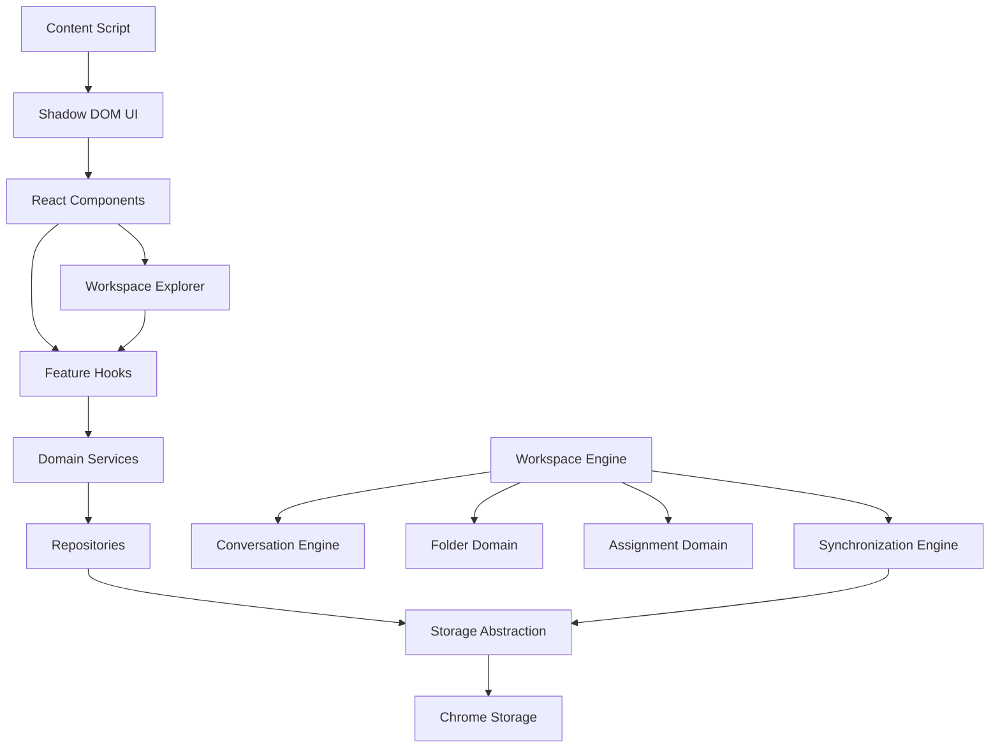

# AI Workspace

AI Workspace is a local-first workspace platform for organizing and working across AI conversations. It currently ships as a Chrome Extension for ChatGPT, but the architecture is evolving toward a provider-agnostic AI workspace capable of supporting ChatGPT, Claude, Gemini, Grok, Perplexity, DeepSeek, OpenRouter, OpenAI API, Anthropic API, local LLMs, and future providers through adapter modules.

The current product includes the foundation, injected Shadow DOM UI, Provider-Agnostic Platform architecture, Workspace Explorer, Universal Search Engine, Quick Action Framework, AI Intelligence architecture, favorites, folder management, conversation detection, conversation assignment, and persistence/synchronization infrastructure. Tags, full export generation, provider-backed AI calls, cloud sync, accounts, payments, and analytics are intentionally out of scope until the core local workflow is stable.

## Tech Stack

- Chrome Extension Manifest V3
- React
- TypeScript
- Vite
- Tailwind CSS
- Chrome Storage API
- Content Scripts
- Background Service Worker
- ESLint, Prettier, Husky, lint-staged

## Installation

```bash
npm install
```

## Development

```bash
npm run dev
```

For extension testing, build the project and load `dist/` into Chrome. The Vite dev server is useful for popup/options work, while the content script should be verified as a built extension.

## Build

```bash
npm run build
```

The Chrome-loadable extension is emitted to `dist/`.

## Quality Checks

```bash
npm run typecheck
npm run lint
npm run format:check
npm run check
```

`npm run check` is the release gate. It runs TypeScript, ESLint, Prettier check, and both Vite builds.

## Load Into Chrome

1. Run `npm run build`.
2. Open `chrome://extensions`.
3. Enable Developer mode.
4. Click `Load unpacked`.
5. Select the repository `dist/` directory.
6. Open `https://chatgpt.com/` and verify the floating ChatGPT Workspace button appears.

## Architecture Overview



## Folder Overview

```text
src/
  app/                 Application engines and cross-feature orchestration
  app/synchronization/ Persistence, snapshots, recovery, and sync events
  app/workspace/       Workspace lifecycle, commands, queries, and registry
  background/          Manifest V3 background service worker
  constants/           Product, storage, settings, and UI constants
  content/             ChatGPT page injection, Shadow DOM UI, and content UI
  features/            Domain modules for folders, conversations, assignments
  options/             Options page entry point
  platform/            Provider-agnostic runtime, provider adapters, plugins
  popup/               Popup entry point
  services/            Future generic service descriptors
  shared/              Errors, logger, and shared entity types
  state/               Lightweight external-store implementation
  storage/             Chrome Storage adapter and storage interfaces
  styles/              Global Tailwind CSS
  types/               Environment and asset declarations
```

## Implemented Modules

- Workspace Engine: coordinates lifecycle, commands, queries, and subsystem registration.
- Provider Platform: adapter registry, provider lifecycle, sessions, capabilities, authentication, streaming, message pipeline, plugin registry, cache, and telemetry.
- Workspace Explorer: file-manager-style interface for folder navigation, conversation lists, filters, counters, active conversation visibility, and assignment visibility.
- Universal Search Engine: provider-based indexed search for folders, conversations, assignments, recent search history, suggestions, and future semantic providers.
- Quick Action Framework: provider-registered actions, context menus, bulk selection, folder picker, copy/open actions, rename, favorites, and export placeholders.
- AI Intelligence Layer: provider registry, task manager, job queue, cache, history, settings, semantic placeholders, hooks, and privacy-first orchestration without external provider calls.
- Conversation Engine: detects current/listed ChatGPT conversations with centralized selectors and MutationObserver cleanup.
- Folder Domain: model, validation, repository, service, hooks, and management UI.
- Assignment Domain: maps conversations to folders with repository/service/state/event boundaries.
- Synchronization Engine: persists snapshots, restores state, handles conflicts, queues writes, and exposes sync hooks.
- Injected UI: React rendered inside Shadow DOM with isolated styles and reduced-motion support.

## Security Posture

- Minimal extension permission set: `storage` only.
- Content scripts are restricted to ChatGPT origins.
- Explicit Manifest V3 extension page CSP.
- No dangerous HTML sinks, dynamic code execution, token storage, or cross-window messaging.
- Chrome Storage reads are validated before use and treated as untrusted.

## Contribution Guidelines

- Keep TypeScript strict.
- Do not use `any`.
- Do not access Chrome APIs from UI components.
- Keep business logic in services/hooks, not visual components.
- Keep ChatGPT DOM access inside the conversation/content infrastructure.
- Keep provider-specific code inside provider adapters.
- Keep files focused; components should remain small and composable.
- Run `npm run check` before submitting changes.
